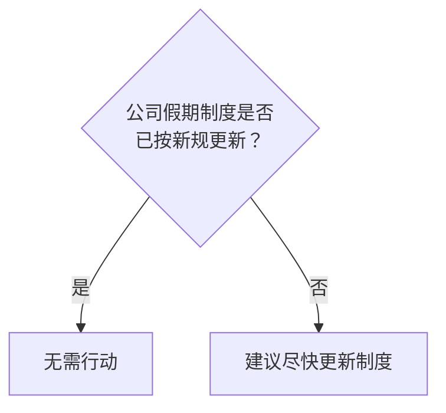

# Legal Risk Visualization

## Overview

- **输入：** 法律分析文本（简要或详尽均可）
- **输出：** 结构化风险分析报告（Markdown 格式 + 4 张 PNG 图片）
- **报告语言：** 始终中文
- **核心理念：** 第三层（影响路径图）为唯一数据源头，其他三层从中派生
- **渲染工具：** matplotlib（雷达图、风险矩阵）+ mmdc（Mermaid 影响路径图、决策树）
- **读者定位：** 法律人 + 业务决策者，报告主体不使用工程化缩写

本 skill 将线性法律分析文本转化为网络化风险结构，支持内部决策与系统化风险管理。

**不是**简单风险评分工具，**而是**法律推理结构的可视化表达系统。

## 术语规范

全技能范围内使用以下中文术语，**主报告中不使用英文缩写**：

| 术语 | 含义 | 仅附录中可出现的缩写 |
|------|------|---------------------|
| 风险指数 | 单节点综合风险评分 | NRS |
| 传导风险值 | 沿路径累积的风险 | PCR |
| 发生可能性 | 该风险发生的概率 | P |
| 影响严重性 | 该风险造成的损害程度 | I |
| 可干预程度 | 当事人可主动干预的程度 | C |
| 可补救程度 | 风险后果可修复的程度 | R |

节点类型在图表中使用颜色 + 图例区分，**不在节点文本中显示类型标签**：

| 内部分类 | 图表显示标签 | 颜色 |
|---------|------------|------|
| 事实节点 | 风险源头 | 🔴 红色 `#E74C3C` |
| 法律判断节点 | 中间环节 | 🔵 蓝色 `#3498DB` |
| 风险结果节点 | 风险后果 | 🟠 橙色 `#F39C12` |
| 商业影响节点 | 业务影响 | 🟣 紫色 `#9B59B6` |

边标签简化规则（数值权重仅保留在附录）：

| 传导强度 | 图中表现 | 附录中完整标注 |
|---------|---------|---------------|
| 强传导 | 粗箭头 `==>` | 强因果 0.9 |
| 中传导 | 普通箭头 `-->` | 中因果 0.6 |
| 弱传导/待确认 | 虚线 `-.->` + `"待确认"` | 弱因果 0.3 |

统一配色方案（全部图表一致）：

| 颜色 | 色号 | 含义 |
|------|------|------|
| 🟢 绿色 | `#27AE60` | 安全/较低（1-2级） |
| 🟡 黄色 | `#F39C12` | 关注/中等（3级） |
| 🔴 红色 | `#E74C3C` | 警戒/较高（4-5级） |
| 🔵 蓝色 | `#3498DB` | 可干预节点 |
| ⚫ 灰色 | `#95A5A6` | 待确认关系 |

## Workflow（7 步顺序执行）

### Step 1：读取并理解法律分析文本

1. 通读全文，识别法律领域（合同纠纷、知识产权、劳动争议、公司治理等）
2. 确定具体场景和涉及方
3. 选择适用的风险维度（从以下维度中选择 4-6 个）：
   - 合规风险、诉讼风险、财务风险、声誉风险、政策风险、执行风险、运营风险
   - 可根据行业特征增加特定维度
4. 维度选择依据：文本涉及的风险类别覆盖情况

### Step 2：抽取风险节点

从文本中识别以下类型的表述，每个表述对应一个风险节点：

| 表述类型 | 识别特征 |
|----------|----------|
| 风险描述 | "存在…风险""可能面临…" |
| 不确定性判断 | "尚不明确""有待确认""存在争议" |
| 可能后果 | "可能导致""将面临""后果为" |
| 条件触发语句 | "若…则…""一旦…就…""在…情况下" |

输出节点列表，每个节点包含：
- **编号**（N1, N2, ...）
- **名称**（简短描述）
- **来源文本依据**（原文引用）

### Step 3：分类节点并建立因果

#### 3a. 节点分类

将每个节点归类为以下四种类型之一：

| 类型 | 定义 | 典型特征 | 图表标签 | 颜色 |
|------|------|----------|---------|------|
| 事实节点 | 客观存在的状态或条件 | 合同条款、已发生事件 | 风险源头 | 🔴 红色 |
| 法律判断节点 | 需要法律推理才能确定的判断 | 责任认定、合规性判断 | 中间环节 | 🔵 蓝色 |
| 风险结果节点 | 最终的法律后果 | 赔偿、处罚、判决结果 | 风险后果 | 🟠 橙色 |
| 商业影响节点 | 对业务运营的实际影响 | 资金流、声誉、运营 | 业务影响 | 🟣 紫色 |

#### 3b. 识别显式因果

通过逻辑连接词识别直接因果关系：
- 因此、所以、导致、造成、引发、使得
- 若…则…、如果…将…、一旦…就…
- 进而、从而、继而、以致
- 由于、鉴于、基于

显式因果 → **高置信度 ●●●**

#### 3c. 识别隐含因果

参考 **[references/causal-patterns.md](references/causal-patterns.md)** 识别三种隐含模式：

1. **并列暗示型** → 默认低置信度 ●○○
2. **背景预设型** → 默认中置信度 ●●○
3. **专业常识型** → 根据通用性判断（通用法律常识→高，行业特定→中，推测性→低）

#### 3d. 设定边权重

| 传导类型 | 系数 | 适用场景 |
|----------|------|----------|
| 强传导 | 0.9 | 前因几乎必然导致后果 |
| 中传导 | 0.6 | 前因大概率导致后果 |
| 弱传导 | 0.3 | 前因可能导致后果 |
| 条件传导 | 0.1-0.9 | 取决于特定条件 |

### Step 4：计算风险属性

#### 4a. 节点属性评估

为每个节点评估四个属性（0-1 范围）：

| 属性 | 含义 |
|------|------|
| 发生可能性 | 该风险发生的可能性 |
| 影响严重性 | 该风险造成的损害程度 |
| 可干预程度 | 当事人可干预的程度 |
| 可补救程度 | 风险后果可修复的程度 |

#### 4b. 计算风险指数

```
风险指数 = 发生可能性 × 影响严重性 × (1 - 可干预程度) × (1 - 可补救程度)
```

**必须在附录中展示每个节点的完整计算过程。**

#### 4c. 计算传导风险值

```
传导风险值 = 起点风险指数 × ∏(边权重_i)
```

处理规则详见 **[references/formulas.md](references/formulas.md)**：
- **分叉：** 各分支独立传导
- **汇聚（OR，默认）：** 取各入边传导风险值最大值
- **汇聚（AND）：** 取各入边传导风险值乘积（仅当法律逻辑要求"同时满足"时）
- **反馈环路：** 拓扑排序识别，最大迭代 3 轮，收敛条件 < 5%

### Step 5：识别关键节点与路径

识别以下四类关键节点：

| 节点类型 | 识别标准 | 意义 |
|----------|----------|------|
| 根源节点 | 入度 = 0 | 风险源头 |
| 放大节点 | 高出度的分叉点 | 风险扩散器 |
| 可控节点 | 可干预程度 > 0.3 | 优先干预目标 |
| 关键路径节点 | 位于最大传导风险值路径上 | 核心传导链 |

**关键路径** = 从根节点到叶节点的所有路径中传导风险值最大的路径。

### Step 6：生成四层输出

所有数据均从第三层（影响路径图）派生。

#### 第一层：雷达图维度评分

1. 将所有叶节点按风险维度分组
2. 每个维度评分 = 该维度下叶节点传导风险值最大值
3. 映射为 1-5 等级：

```
等级 = ceil(传导风险值 × 4) + 1，上限 5
```

4. 使用 **[references/anchoring-tables.md](references/anchoring-tables.md)** 中的锚定表校准等级标签

#### 第二层：风险矩阵（matplotlib 散点图）

取所有叶节点（终端风险），生成 matplotlib 四象限散点图：

- 横轴 = 发生可能性（0→1）
- 纵轴 = 影响严重性（0→1）
- 气泡大小 = 风险指数
- 颜色 = 象限对应色（统一配色方案）
- 四象限中文标签：高优先级 / 重点关注 / 常规监控 / 持续观察

数据格式（传给 `render_risk_matrix.py`）：
```json
[
  {"name": "节点名称", "p": 0.9, "i": 0.6, "score": 0.34},
  ...
]
```

#### 第三层：影响路径图（Mermaid）

生成 Mermaid 流程图，遵循以下规则：


图下方添加中文图例：
> **图例说明：** 🔴 红色 = 风险源头 | 🔵 蓝色 = 中间环节 | 🟠 橙色 = 风险后果 | 🟣 紫色 = 业务影响 | 粗线 = 强传导关系 | 虚线 = 待确认关系

#### 第四层：决策树（Mermaid graph TD）

基于可干预节点（可干预程度 > 0.3）生成 Mermaid 决策树。

菱形判断节点使用**是非问答形式**（非阈值数值）：



每个判断节点：
- 将风险节点名称转化为**是非问题**（"是否…？""有没有…？"）
- 分支标签只用 `"是"` / `"否"`
- 动作节点根据紧急程度着色

### Step 7：输出报告与图形渲染

使用 **[assets/report-template.md](assets/report-template.md)** 模板生成完整 Markdown 报告。

报告结构（面向两类读者的分层设计）：

```
一、风险概览        ← 决策者看这里（1页，交通灯摘要表 + 雷达图 + 核心建议）
二、核心发现与建议   ← 决策者+法律人（叙事式风险发现，非节点表格）
三、风险全景图      ← 两类读者（4张图 + 每张图前一句中文引导语）
四、风险情景分析    ← 法律人用来讲故事的场景推演
五、行动方案        ← 两类读者（含负责部门、建议时限、预期效果）
附录：分析方法与计算详情 ← 仅法律专业人员参考（公式、完整计算过程）
```

关键输出原则：
- **主报告中不出现英文缩写**（NRS/PCR/P/I/C/R 仅在附录）
- **主报告中不出现节点内部类型名**（事实节点/法律判断节点等），用颜色+图例区分
- **叙事优先**：核心发现用完整段落描述，不用表格堆砌
- **情景化**：每条关键路径写一个具体场景推演（事实→法律问题→可能后果→应对窗口）

#### 7a. 图形渲染步骤

**画布尺寸动态计算规则：**

Mermaid 图表渲染时需要根据节点数量动态调整画布尺寸，避免字体重叠：

| 节点数量 | 建议画布尺寸 | 适用场景 |
|----------|--------------|----------|
| ≤ 8 个节点 | 1200 x 900 | 简单流程 |
| 9-12 个节点 | 1600 x 1200 | 中等复杂度 |
| 13-16 个节点 | 2000 x 1500 | 较复杂 |
| > 16 个节点 | 2400 x 1800 | 高复杂度 |

> **注意：** 中文文字比英文更宽，建议在上述基础上增加 20% 宽度。

在输出目录中生成 4 张 PNG 图片：

1. **第一层雷达图** → `risk_radar.png`
   ```bash
   python3 ~/.claude/skills/legal-risk-visualization/scripts/render_radar.py \
     --data '{"维度1":分数, "维度2":分数, ...}' \
     --output <输出目录>/risk_radar.png
   ```
2. **第二层风险矩阵** → `risk_matrix.png`（**使用 matplotlib，非 Mermaid**）
   ```bash
   python3 ~/.claude/skills/legal-risk-visualization/scripts/render_risk_matrix.py \
     --data '[{"name":"节点名称","p":0.9,"i":0.6,"score":0.34}, ...]' \
     --output <输出目录>/risk_matrix.png
   ```
3. **第三层影响路径图** → `impact_pathway.png`
   - 将 graph TD Mermaid 代码写入 `impact_pathway.mmd`
   - 调用渲染脚本（根据节点数量动态设置尺寸）：
   ```bash
   # 影响路径图节点数量通常在 8-14 之间，建议使用 1600x1200
   python3 ~/.claude/skills/legal-risk-visualization/scripts/render_mermaid.py \
     --input <输出目录>/impact_pathway.mmd \
     --output <输出目录>/impact_pathway.png \
     --width 1600 --height 1200
   ```
4. **第四层决策树** → `decision_tree.png`
   - 将 graph TD Mermaid 代码写入 `decision_tree.mmd`
   - 调用渲染脚本（根据节点数量动态设置尺寸）：
   ```bash
   # 决策树节点数量通常在 6-12 之间，建议使用 1400x1000
   python3 ~/.claude/skills/legal-risk-visualization/scripts/render_mermaid.py \
     --input <输出目录>/decision_tree.mmd \
     --output <输出目录>/decision_tree.png \
     --width 1400 --height 1000
   ```

在 Markdown 报告中嵌入图片引用：``

## Output Format

输出目录包含：
- **1 份 Markdown 报告**，包含：
  - 风险概览（交通灯摘要表）
  - 核心发现与建议（叙事式）
  - 风险全景图（4 张图 + 引导语）
  - 风险情景分析（场景推演）
  - 行动方案（含负责部门、建议时限）
  - 附录（公式、完整计算过程）
  - 图片引用（``）
- **4 张 PNG 图片**：
  - `risk_radar.png` — 风险雷达图（matplotlib 生成，含色带背景和等级标签）
  - `risk_matrix.png` — 风险矩阵四象限图（matplotlib 生成，全中文标签）
  - `impact_pathway.png` — 影响路径有向图（Mermaid graph TD，简化节点和边标签）
  - `decision_tree.png` — 决策树（Mermaid graph TD，是非问答形式）

## Dependencies

| 工具 | 用途 | 安装方式 |
|------|------|----------|
| matplotlib | 雷达图和风险矩阵渲染 | `pip3 install matplotlib` |
| numpy | 雷达图色带渲染 | `pip3 install numpy`（通常随 matplotlib 安装） |
| mmdc (mermaid-cli) | Mermaid 图渲染（影响路径图、决策树） | `npm install -g @mermaid-js/mermaid-cli` |
| Chrome/Chromium | mmdc 的浏览器后端 | macOS 自带或手动安装 |

## Key Rules

### 客户导向规则

1. **面向读者：** 报告主体面向法律人和业务决策者，术语使用中文全称，不使用工程化缩写
2. **叙事优先：** 核心发现用完整段落描述，避免大量表格堆砌
3. **可讲述性：** 报告第一节+第三节应能支持 5 分钟内向业务部门口头汇报核心风险
4. **情景驱动：** 每条关键路径需转化为具体场景推演，帮助非法律人理解风险传导逻辑

### 数据完整性规则

5. **单一数据源：** 第三层（影响路径图）是唯一数据源头，其他三层的数据必须从第三层派生
6. **计算透明：** 风险指数和传导风险值计算必须完整展示过程（放在附录中）
7. **雷达图校准：** 雷达图评分必须使用锚定表校准，不可凭感觉打分

### 因果关系规则

8. **置信度标注：** 低置信度因果关系必须用虚线标注并注明"待确认"
9. **隐含因果标记：** 所有隐含因果关系必须在附录中标注模式类型和置信度
10. **显式优先：** 优先采用显式因果，隐含因果作为补充

### 可视化规则

11. **全中文：** 所有图表标签、轴标签、图例必须为中文，不得出现英文
12. **统一配色：** 全部图表使用统一交通灯色系（绿/黄/红/蓝/灰）
13. **关键路径高亮：** 影响路径图中关键路径必须加粗/变色显示
14. **节点着色：** 按节点类型使用对应颜色区分（红/蓝/橙/紫）
15. **图例说明：** 每张图下方需附中文图例说明

### 决策规则

16. **是非问答：** 决策树使用是非问题形式，不使用数值阈值
17. **行动建议：** 必须按紧急程度排序，包含负责部门和建议时限
18. **可控节点优先：** 行动建议优先针对可干预节点，尤其是关键路径上的可干预节点

## References

- **[references/formulas.md](references/formulas.md)** — 完整计算模型（风险指数、传导风险值、映射公式、分叉/汇聚/环路规则）
- **[references/causal-patterns.md](references/causal-patterns.md)** — 因果关系识别（显式+隐含模式+置信度）
- **[references/anchoring-tables.md](references/anchoring-tables.md)** — 各维度 1-5 等级锚定表
- **[references/case-example.md](references/case-example.md)** — 技术服务合同纠纷端到端案例

## Example

完整端到端案例见 **[references/case-example.md](references/case-example.md)**。

该案例演示了从"技术服务合同纠纷"原始法律分析文本，经过 7 步工作流，生成包含 7 个节点、2 条路径、完整四层输出的风险可视化报告的全过程。
