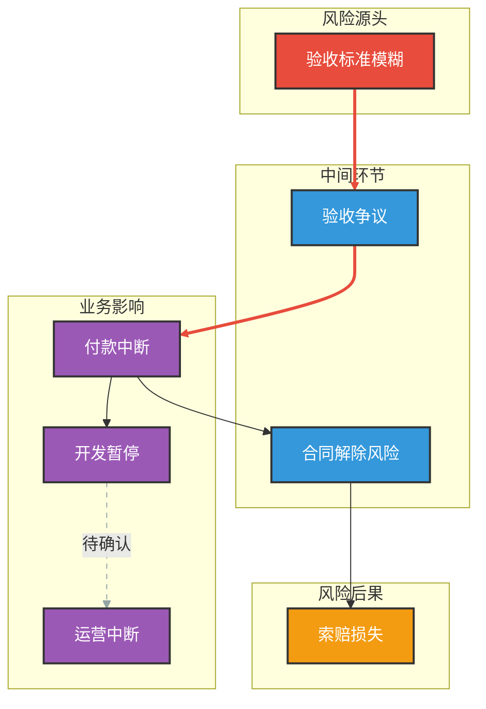
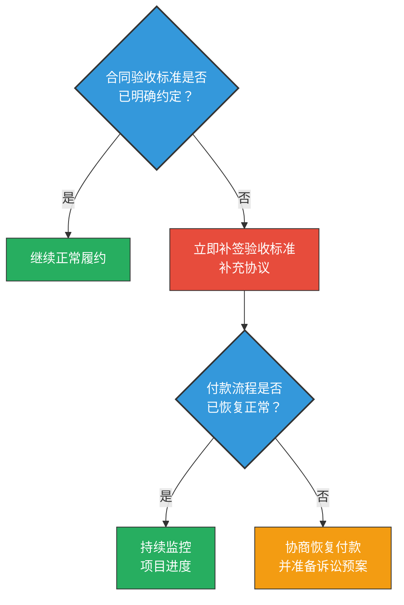

# 端到端案例：技术服务合同纠纷

## 原始法律分析文本

> 甲公司与乙公司签订技术服务合同，约定乙方为甲方开发定制化管理系统，
> 合同总金额 500 万元，分三期支付。
>
> 目前存在以下问题：
>
> 1. 合同中对"验收标准"的描述较为模糊，仅写明"符合行业通常标准"，
>    未约定具体的功能清单和性能指标。
> 2. 乙方已交付第一期成果，但甲方认为功能不完整，拒绝支付第二期款项。
> 3. 乙方因此暂停开发工作，并发函催告付款。
> 4. 双方就"已交付成果是否符合合同约定"存在根本分歧。
> 5. 乙方表示若甲方继续拒付，将解除合同并索赔。
> 6. 鉴于该系统与甲方核心业务深度绑定，系统停摆将直接影响甲方日常运营。

---

## 分析过程（7 步工作流）

### Step 1：抽取风险节点

从文本中识别 7 个风险节点：

| 编号 | 节点名称 | 来源文本依据 |
|------|----------|--------------|
| N1 | 验收标准模糊 | "描述较为模糊" |
| N2 | 验收争议 | "甲方认为功能不完整" |
| N3 | 付款中断 | "拒绝支付第二期款项" |
| N4 | 开发暂停 | "乙方因此暂停开发工作" |
| N5 | 合同解除风险 | "将解除合同并索赔" |
| N6 | 运营中断 | "系统停摆将直接影响日常运营" |
| N7 | 索赔损失 | "解除合同并索赔" |

### Step 2：分类节点类型

| 编号 | 内部类型 | 图表标签 | 颜色 | 说明 |
|------|---------|---------|------|------|
| N1 | 事实节点 | 风险源头 | 🔴 红色 | 合同条款的客观状态 |
| N2 | 法律判断节点 | 中间环节 | 🔵 蓝色 | 是否符合约定需法律判断 |
| N3 | 商业影响节点 | 业务影响 | 🟣 紫色 | 资金流中断 |
| N4 | 商业影响节点 | 业务影响 | 🟣 紫色 | 项目进度停滞 |
| N5 | 法律判断节点 | 中间环节 | 🔵 蓝色 | 解除权是否成立需法律判断 |
| N6 | 商业影响节点 | 业务影响 | 🟣 紫色 | 核心业务受损 |
| N7 | 风险结果节点 | 风险后果 | 🟠 橙色 | 最终经济损失 |

### Step 3：建立因果方向

**显式因果：**

| 关系 | 传导类型 | 附录中的权重 | 文本依据 |
|------|----------|-------------|---------|
| N1 → N2 | 强传导 | 0.9 | "描述较为模糊"直接导致争议 |
| N2 → N3 | 强传导 | 0.9 | "认为功能不完整，拒绝支付" |
| N3 → N4 | 中传导 | 0.6 | "因此暂停开发工作" |
| N3 → N5 | 中传导 | 0.6 | "若继续拒付，将解除合同" |

**隐含因果：**

| 关系 | 模式 | 置信度 | 附录中的权重 | 依据 |
|------|------|--------|-------------|------|
| N4 → N6 | 背景预设型 | ●●○ 中 | 0.3 | "系统与核心业务深度绑定" |
| N5 → N7 | 专业常识型 | ●●● 高 | 0.6 | 合同解除必然伴随索赔 |

### Step 4：标注风险属性

| 编号 | 发生可能性 | 影响严重性 | 可干预程度 | 可补救程度 | 风险指数 | 计算过程 |
|------|:---:|:---:|:---:|:---:|:---:|----------|
| N1 | 1.0 | 0.4 | 0.3 | 0.2 | 0.224 | 1.0×0.4×0.7×0.8 |
| N2 | 0.9 | 0.5 | 0.4 | 0.5 | 0.135 | 0.9×0.5×0.6×0.5 |
| N3 | 0.7 | 0.6 | 0.6 | 0.7 | 0.050 | 0.7×0.6×0.4×0.3 |
| N4 | 0.8 | 0.7 | 0.2 | 0.3 | 0.314 | 0.8×0.7×0.8×0.7 |
| N5 | 0.5 | 0.9 | 0.5 | 0.1 | 0.203 | 0.5×0.9×0.5×0.9 |
| N6 | 0.6 | 0.8 | 0.1 | 0.2 | 0.346 | 0.6×0.8×0.9×0.8 |
| N7 | 0.4 | 0.8 | 0.3 | 0.1 | 0.202 | 0.4×0.8×0.7×0.9 |

### Step 5：识别关键节点与路径

**关键节点：**

| 类型 | 节点 | 说明 |
|------|------|------|
| 根源节点 | N1 | 唯一入度为 0 的节点 |
| 放大节点 | N3 | 出度为 2，分叉节点 |
| 可控节点 | N3 | 可干预程度 0.6 最高，优先干预目标 |

**传导风险值计算：**

路径 A：N1 → N2 → N3 → N4 → N6
```
传导风险值 = 0.224 × 0.9 × 0.9 × 0.6 × 0.3 = 0.033
```

路径 B：N1 → N2 → N3 → N5 → N7
```
传导风险值 = 0.224 × 0.9 × 0.9 × 0.6 × 0.6 = 0.065
```

> **关键路径为路径 B**（传导风险值 0.065 > 路径 A 的 0.033）
> 对应：验收标准模糊 → 验收争议 → 付款中断 → 合同解除 → 索赔损失

---

## 报告输出示例（新格式）

以下展示按照新报告结构生成的完整报告。

---

# 法律风险可视化分析报告

> **分析对象：** 甲公司与乙公司技术服务合同纠纷
> **分析日期：** 2025-05-15
> **风险维度：** 合规风险、诉讼风险、财务风险、声誉风险、运营风险、执行风险

---

## 一、风险概览

**一句话总结：** 本次分析发现合同验收标准模糊是核心风险源头，如不及时补签验收标准补充协议，可能沿"验收争议→付款中断→合同解除→索赔"路径升级，建议优先补签协议、恢复付款流程。

### 风险状态总览

| 风险维度 | 风险等级 | 状态 | 核心发现 |
|---------|---------|------|---------|
| 合规风险 | 1 | 🟢较低 | 合同纠纷不涉及合规问题 |
| 诉讼风险 | 2 | 🟢较低 | 若合同解除，面临索赔诉讼 |
| 财务风险 | 2 | 🟢较低 | 索赔金额可能涉及已付款项和违约金 |
| 声誉风险 | 1 | 🟢较低 | 双方商业纠纷，公众关注度低 |
| 运营风险 | 2 | 🟢较低 | 系统停摆影响日常运营，但尚有替代方案 |
| 执行风险 | 2 | 🟢较低 | 补签协议执行存在协调难度 |

> 🟢较低（1-2级）= 常规关注 | 🟡中等（3级）= 需主动管理 | 🔴较高（4-5级）= 需紧急应对

### 风险雷达图


> **图例说明：** 绿色区域（1-2级）= 安全范围 | 黄色区域（3级）= 关注范围 | 红色区域（4-5级）= 警戒范围。数值越靠外，风险越高。

渲染参数：
```bash
python3 scripts/render_radar.py \
  --data '{"合规风险":1,"诉讼风险":2,"财务风险":2,"声誉风险":1,"运营风险":2,"执行风险":2}' \
  --output risk_radar.png
```

### 核心建议（前三项）

1. **立即补签验收标准补充协议** — 验收标准模糊是所有风险的源头，消除源头可同时降低下游所有风险
2. **协商恢复付款流程** — 付款中断是风险扩散的关键分叉点，恢复付款可阻断合同解除和运营中断两条路径
3. **准备诉讼预案** — 如前两项行动未果，需准备应对合同解除和索赔的法律方案

---

## 二、核心发现与建议

### 发现一：验收标准缺失是全部风险的源头

合同中"验收标准"仅写明"符合行业通常标准"，未约定具体功能清单和性能指标。这一客观事实直接导致了双方对第一期成果是否合格产生根本分歧。

该问题之所以重要，在于它是整个风险传导链的起点——验收标准模糊 → 验收争议 → 付款中断 → 后续连锁反应。如果不解决源头问题，任何下游补救措施都只是治标。

**建议：** 尽快与乙方协商，补签一份详细的验收标准补充协议，明确功能清单、性能指标和验收流程。

### 发现二：付款中断是风险扩散的关键环节

甲方拒绝支付第二期款项后，风险从单一的验收争议扩散为两条独立路径：一是乙方暂停开发导致运营风险，二是乙方威胁解除合同导致法律和财务风险。

付款中断节点是整个风险网络中可干预程度最高的环节（可干预程度 0.6），也是唯一的扩散分叉点。通过恢复付款，可以同时阻断两条下游风险路径。

**建议：** 在补签验收标准的基础上，与乙方协商分阶段恢复付款。可考虑设置第三方托管账户作为折中方案。

### 发现三：合同解除将导致实质性经济损失

如果乙方行使合同解除权，甲方将面临两方面损失：一是已投入的定制化开发费用可能无法全额回收，二是乙方的违约索赔。加之该系统与甲方核心业务深度绑定，系统停摆期间的运营损失也不可忽视。

**建议：** 在积极协商的同时，准备诉讼预案，评估合同解除后的损失范围和法律应对策略。

---

## 三、风险全景图

### 3.1 风险矩阵：哪些风险最需要优先处理？

> 气泡越靠右上方，风险优先级越高；气泡越大，综合风险指数越高。

渲染参数：
```bash
python3 scripts/render_risk_matrix.py \
  --data '[{"name":"开发暂停","p":0.8,"i":0.7,"score":0.314},{"name":"运营中断","p":0.6,"i":0.8,"score":0.346},{"name":"合同解除风险","p":0.5,"i":0.9,"score":0.203},{"name":"索赔损失","p":0.4,"i":0.8,"score":0.202}]' \
  --output risk_matrix.png
```


> **图例说明：** 横轴 = 发生可能性 | 纵轴 = 影响严重性 | 气泡大小 = 风险指数 | 右上角红色区域 = 高优先级

### 3.2 影响路径图：风险之间如何传导？

> 从风险源头出发，沿箭头方向传导，最终影响业务结果。粗线表示强传导关系。



> **图例说明：** 🔴 红色 = 风险源头 | 🔵 蓝色 = 中间环节 | 🟠 橙色 = 风险后果 | 🟣 紫色 = 业务影响 | 粗线 = 强传导关系 | 虚线 = 待确认关系


### 3.3 决策树：我们应该怎么做？

> 按照图中的是非问题逐一判断，即可确定对应的行动方案。绿色=无需行动，黄色=建议行动，红色=紧急行动。




### 3.4 风险雷达图：各维度风险水平如何？

> 已在第一节展示。多边形越向外扩张，表示该维度风险越高。

---

## 四、风险情景分析

### 情景一：验收争议升级为合同解除

**路径：** 验收标准模糊 → 验收争议 → 付款中断 → 合同解除 → 索赔损失

| 阶段 | 内容 |
|------|------|
| **起因（事实）** | 合同仅约定"符合行业通常标准"作为验收标准，缺乏具体功能清单和性能指标。乙方交付第一期成果后，甲方以"功能不完整"为由拒绝验收和付款。 |
| **法律问题** | 验收标准模糊导致"是否符合合同约定"缺乏客观判断依据。乙方催告付款后，甲方继续拒付可能构成根本违约，触发乙方的法定合同解除权。 |
| **可能后果** | 乙方解除合同后，甲方面临：(1) 已付款项的返还争议；(2) 乙方的违约损害赔偿索赔；(3) 需重新选择供应商，项目延期。 |
| **应对窗口** | 当前处于付款中断阶段，尚未进入正式解除程序。甲方仍有主动协商空间，但窗口正在收窄——乙方已发函催告。 |
| **建议行动** | 7 天内启动验收标准协商，同步评估第一期成果实际完成度，寻求双方均可接受的验收方案。 |

### 情景二：开发暂停导致运营影响

**路径：** 验收标准模糊 → 验收争议 → 付款中断 → 开发暂停 → 运营中断

| 阶段 | 内容 |
|------|------|
| **起因（事实）** | 甲方拒付导致乙方暂停开发工作。该定制化管理系统与甲方核心业务深度绑定。 |
| **法律问题** | 乙方暂停开发是否构成合同义务的中止？甲方拒付在先的情况下，乙方行使同时履行抗辩权的法律效果如何？ |
| **可能后果** | 系统开发停滞 → 甲方被迫使用旧有系统或人工流程替代 → 运营效率下降、人力成本上升 → 核心业务受损。 |
| **应对窗口** | 目前开发刚暂停，甲方可通过恢复部分付款快速推动项目重启。但如果拖延过久，乙方可能将开发资源调配到其他项目。 |
| **建议行动** | 在补签验收标准的同时，协商分阶段恢复付款（如先支付部分争议外款项），推动开发尽快恢复。 |

---

## 五、行动方案

| 优先级 | 行动内容 | 负责部门 | 建议时限 | 预期效果 |
|--------|---------|---------|---------|---------|
| 🔴 紧急 | 补签验收标准补充协议，明确功能清单和性能指标 | 法务部 + 业务部 | 7 天内 | 消除风险源头（N1），阻断全部下游风险 |
| 🟡 重要 | 协商恢复付款流程，可考虑第三方托管账户方案 | 财务部 + 法务部 | 14 天内 | 降低付款中断分叉传导（N3），阻断运营中断和合同解除两条路径 |
| 🟡 重要 | 准备诉讼预案，评估合同解除后的损失范围和法律应对 | 法务部 | 1 个月内 | 应对路径 B（合同解除→索赔）的最坏情况 |

---

## 附录：分析方法与计算详情

### 附录 A：风险节点清单

| 编号 | 名称 | 类型 | 发生可能性(P) | 影响严重性(I) | 可干预程度(C) | 可补救程度(R) | 风险指数(NRS) | 时间窗口 |
|------|------|------|:---:|:---:|:---:|:---:|:---:|:---:|
| N1 | 验收标准模糊 | 事实节点 | 1.0 | 0.4 | 0.3 | 0.2 | 0.224 | ⚡ |
| N2 | 验收争议 | 法律判断节点 | 0.9 | 0.5 | 0.4 | 0.5 | 0.135 | ⚡ |
| N3 | 付款中断 | 商业影响节点 | 0.7 | 0.6 | 0.6 | 0.7 | 0.050 | S |
| N4 | 开发暂停 | 商业影响节点 | 0.8 | 0.7 | 0.2 | 0.3 | 0.314 | S |
| N5 | 合同解除风险 | 法律判断节点 | 0.5 | 0.9 | 0.5 | 0.1 | 0.203 | M |
| N6 | 运营中断 | 商业影响节点 | 0.6 | 0.8 | 0.1 | 0.2 | 0.346 | M |
| N7 | 索赔损失 | 风险结果节点 | 0.4 | 0.8 | 0.3 | 0.1 | 0.202 | L |

### 附录 B：风险指数计算过程

**计算公式：** NRS = P × I × (1-C) × (1-R)

- N1：NRS = 1.0 × 0.4 × (1-0.3) × (1-0.2) = 1.0 × 0.4 × 0.7 × 0.8 = 0.224
- N2：NRS = 0.9 × 0.5 × (1-0.4) × (1-0.5) = 0.9 × 0.5 × 0.6 × 0.5 = 0.135
- N3：NRS = 0.7 × 0.6 × (1-0.6) × (1-0.7) = 0.7 × 0.6 × 0.4 × 0.3 = 0.050
- N4：NRS = 0.8 × 0.7 × (1-0.2) × (1-0.3) = 0.8 × 0.7 × 0.8 × 0.7 = 0.314
- N5：NRS = 0.5 × 0.9 × (1-0.5) × (1-0.1) = 0.5 × 0.9 × 0.5 × 0.9 = 0.203
- N6：NRS = 0.6 × 0.8 × (1-0.1) × (1-0.2) = 0.6 × 0.8 × 0.9 × 0.8 = 0.346
- N7：NRS = 0.4 × 0.8 × (1-0.3) × (1-0.1) = 0.4 × 0.8 × 0.7 × 0.9 = 0.202

### 附录 C：因果关系与传导结构

**显式因果：**

| 关系 | 传导类型 | 边权重 | 文本依据 |
|------|----------|--------|----------|
| N1 → N2 | 强因果 | 0.9 | "描述较为模糊"直接导致验收争议 |
| N2 → N3 | 强因果 | 0.9 | "认为功能不完整，拒绝支付" |
| N3 → N4 | 中因果 | 0.6 | "因此暂停开发工作" |
| N3 → N5 | 中因果 | 0.6 | "若继续拒付，将解除合同" |

**隐含因果：**

| 关系 | 模式 | 置信度 | 边权重 | 依据 |
|------|------|--------|--------|------|
| N4 → N6 | 背景预设型 | ●●○ 中 | 0.3 | "系统与核心业务深度绑定"暗示开发暂停将影响运营 |
| N5 → N7 | 专业常识型 | ●●● 高 | 0.6 | 合同解除权行使后必然伴随损害赔偿索赔（法律常识链） |

### 附录 D：传导风险值计算

**计算公式：** PCR = NRS_起点 × ∏(边权重_i)

**路径 A：** N1 → N2 → N3 → N4 → N6

```
PCR = NRS_N1 × w(N1→N2) × w(N2→N3) × w(N3→N4) × w(N4→N6)
    = 0.224 × 0.9 × 0.9 × 0.6 × 0.3
    = 0.033
```

**路径 B：** N1 → N2 → N3 → N5 → N7

```
PCR = NRS_N1 × w(N1→N2) × w(N2→N3) × w(N3→N5) × w(N5→N7)
    = 0.224 × 0.9 × 0.9 × 0.6 × 0.6
    = 0.065
```

> **关键路径为路径 B**（PCR = 0.065 > 路径 A 的 0.033）

### 附录 E：雷达图维度映射

映射公式：等级 = ceil(PCR × 4) + 1，上限 5

| 维度 | 对应叶节点 | 传导风险值最大值 | 等级（1-5） | 等级标签 |
|------|-----------|----------------|-------------|----------|
| 合规风险 | — | 0 | 1 | 极低 |
| 诉讼风险 | N5, N7 | 0.065 | 2 | 低 |
| 财务风险 | N7 | 0.065 | 2 | 低 |
| 声誉风险 | — | 0 | 1 | 极低 |
| 运营风险 | N6 | 0.033 | 2 | 低 |
| 执行风险 | N4 | 0.033 | 2 | 低 |

### 附录 F：关键节点识别

| 类型 | 节点 | 说明 |
|------|------|------|
| 根源节点 | N1 | 唯一入度为 0 的节点 |
| 放大节点 | N3 | 出度为 2，分叉节点 |
| 可控节点 | N3 | 可干预程度 0.6，优先干预目标 |

---

## 预期输出文件

| 文件名 | 内容 | 渲染方式 |
|--------|------|----------|
| `risk_radar.png` | 六维雷达图（含色带背景和等级标签） | matplotlib（render_radar.py） |
| `risk_matrix.png` | 四象限散点图（全中文标签） | matplotlib（render_risk_matrix.py） |
| `impact_pathway.png` | N1→N7 因果路径有向图（简化节点和边标签） | Mermaid graph TD + mmdc |
| `decision_tree.png` | 是非问答式决策树（交通灯色行动节点） | Mermaid graph TD + mmdc |
